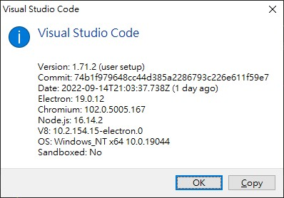
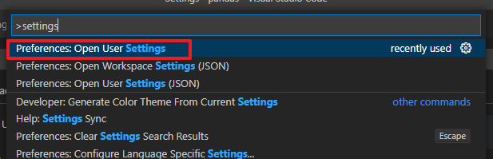
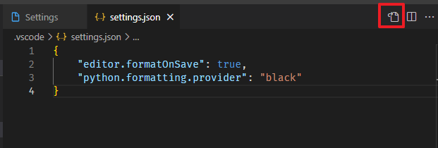
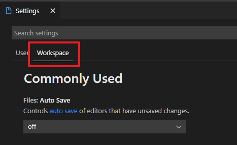

# Visual Studio Code note

## 設定 Settings
### 分類
vscode 的 Settings 依作用範圍的不同，分為兩類
* User
    * 作用範圍：全域
* Workspace
    * 作用範圍：工作目錄
    * vscode 會將設定存在該工作目錄的 **.vscode/settings.json** 檔案中
### 如何進入設定
1. 在 Command Palette 執行 "**settings**" 指令
   - Command Palette 快速鍵：**Ctrl+Shift+P**
2. 選擇 **Preferences: Open User Settings**，即可進入 **Settings** 畫面

### Settings GUI 與 JSON 切換
**Settings** 有分為 **GUI** 與 **JSON** 模式，可用 **Settings** 畫面右上角的按鈕切換

### Settings User 與 Workspace 切換
切換 **User** 與 **Workspace** 的 **Settings** 畫面

### 快速鍵 (Windows)
#### 很常用
1. Quick Open, Go to File: **Ctrl + P**
   - 加上 **>** 符號，會變成 Command Palette
   - 加上 **@** 符號，會變成 Go to Symbol
   - 加上 **:** 符號，會變成 Go to line
     - 功能：後面接第幾行數字就會跳至該行。
2. Command Palette: **Ctrl + Shift + P** 或 **F1**
   - 功能：show and run command
3. Go to Symbol: **Ctrl + Shift + O**
   - 功能：在 **@** 符號後加上關鍵字，可搜尋 Module、Class、Function、Variable... 等名稱。
